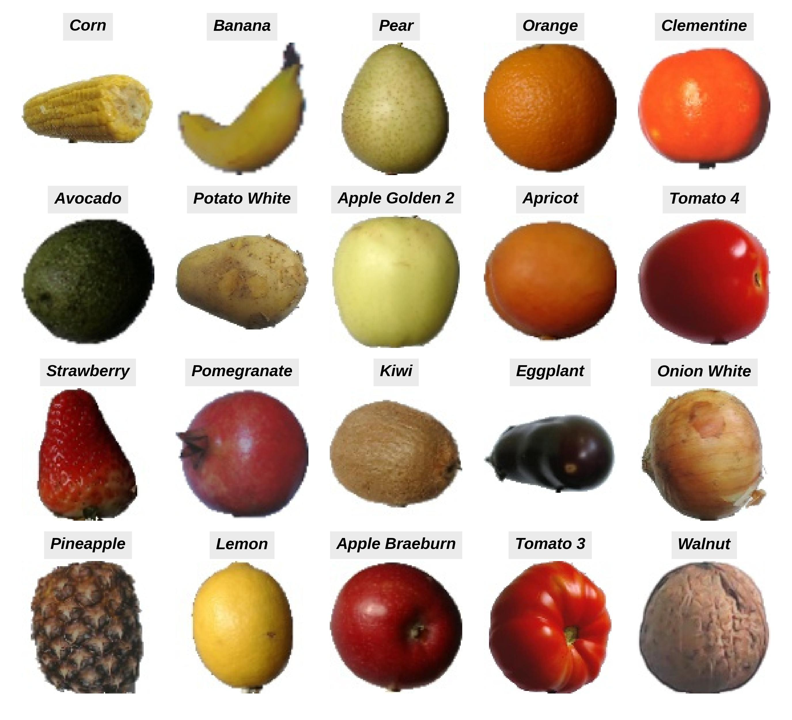

Classify **20 fruits** using a deep neural network model. Try the model with your own image input in the [Streamlit app](https://fruit-classification-atakisihakan.streamlit.app/).

The model is built by fine-tuning *ResNet50* pretrained on *ImageNet* data set. Specifically, prediction layers of *ResNet50* were removed; two custom dense layers were added on top which have been further trained using the [Kaggle dataset](https://www.kaggle.com/datasets/moltean/fruits/data).

